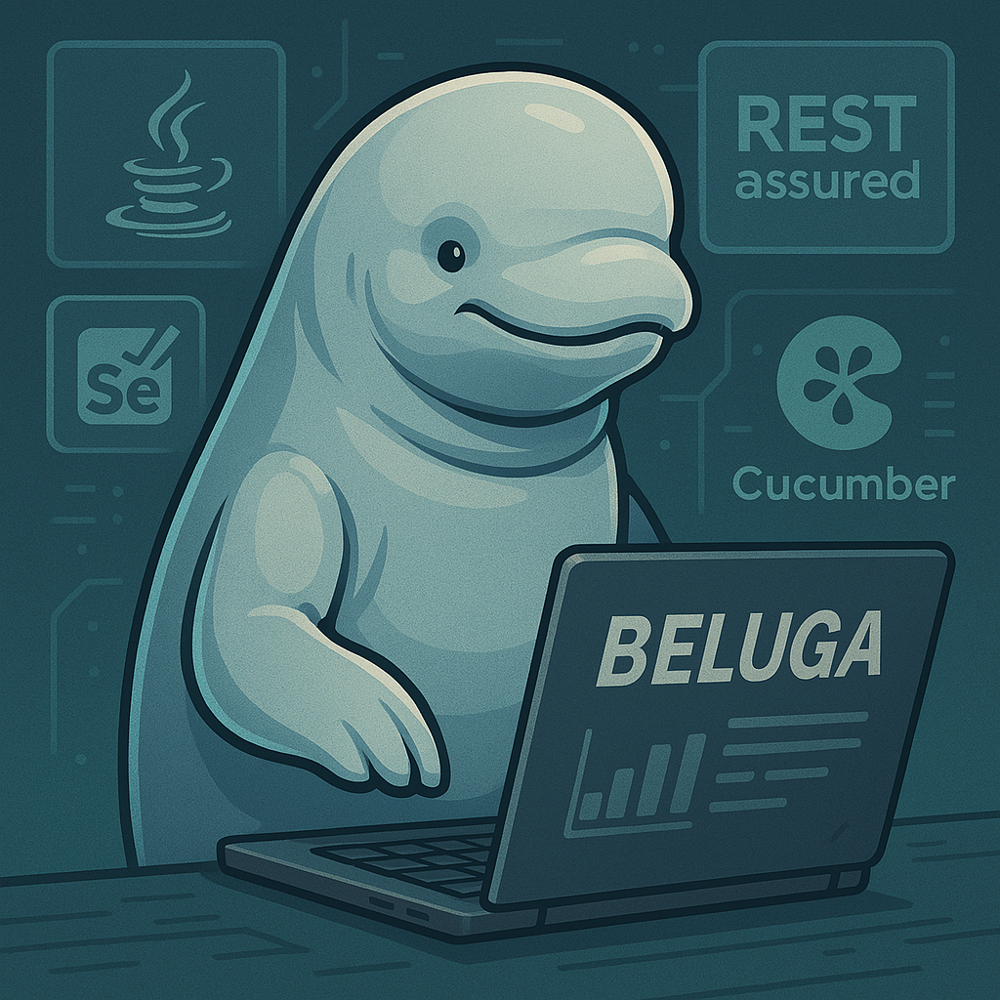
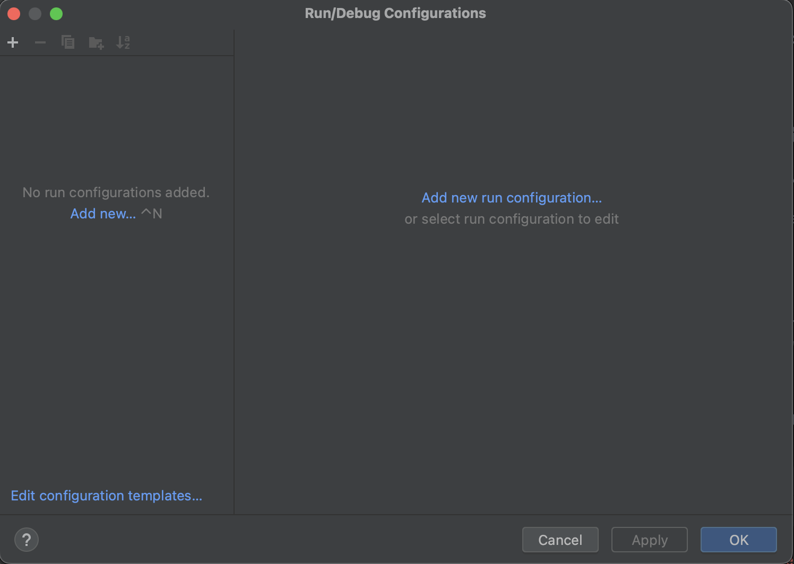
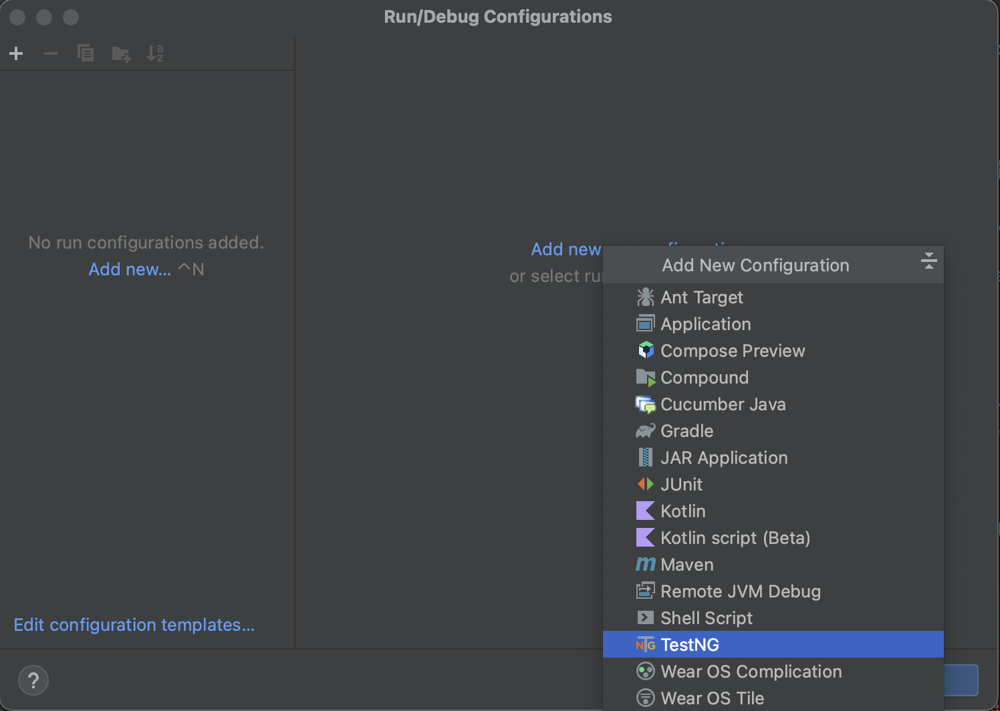
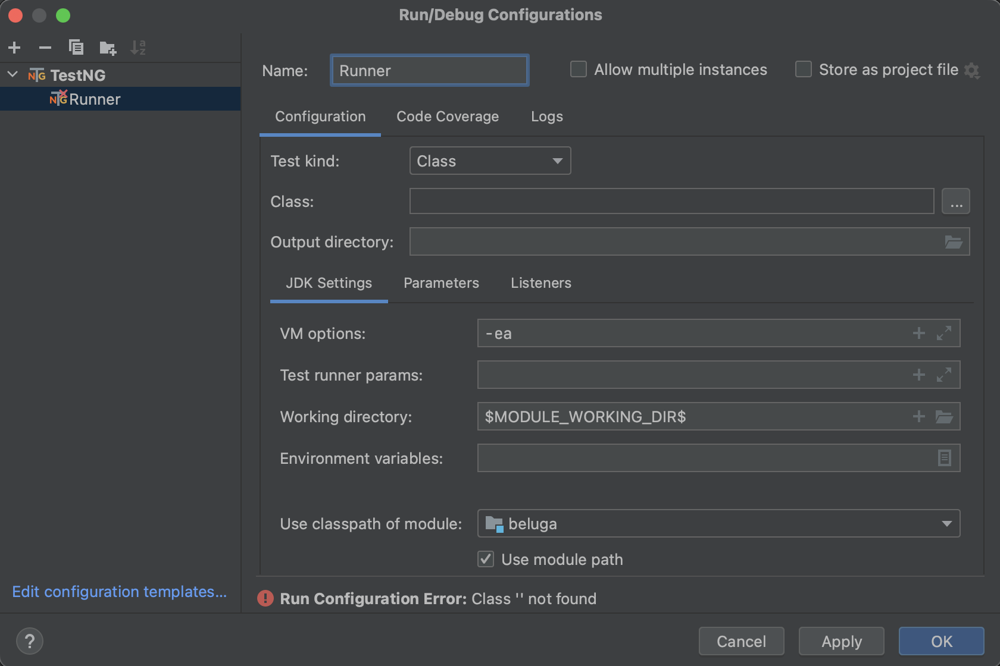
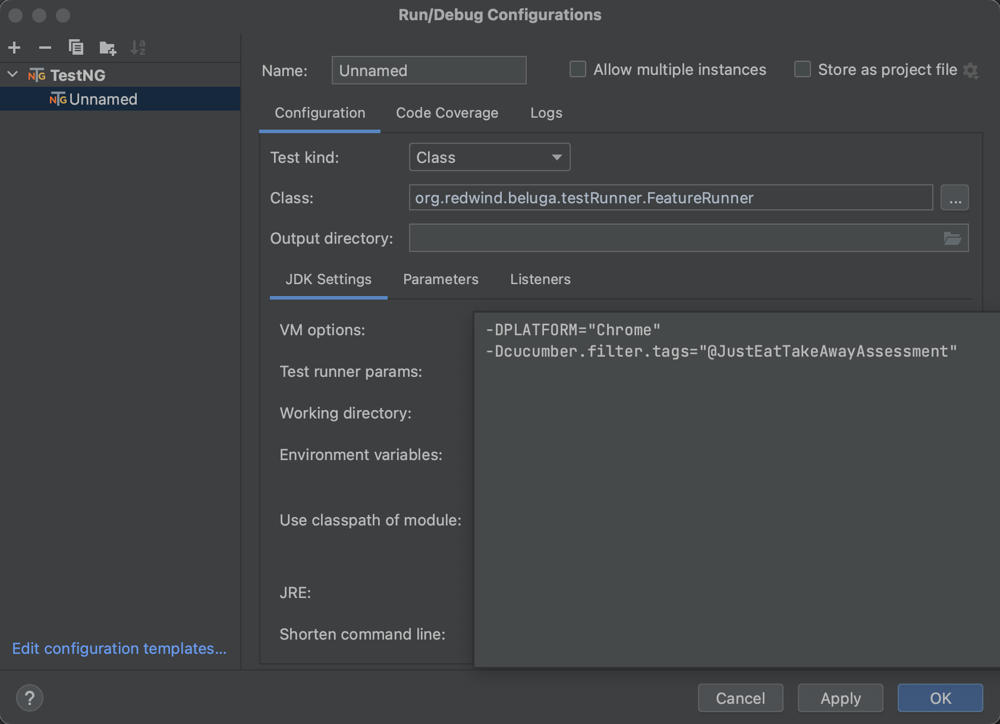
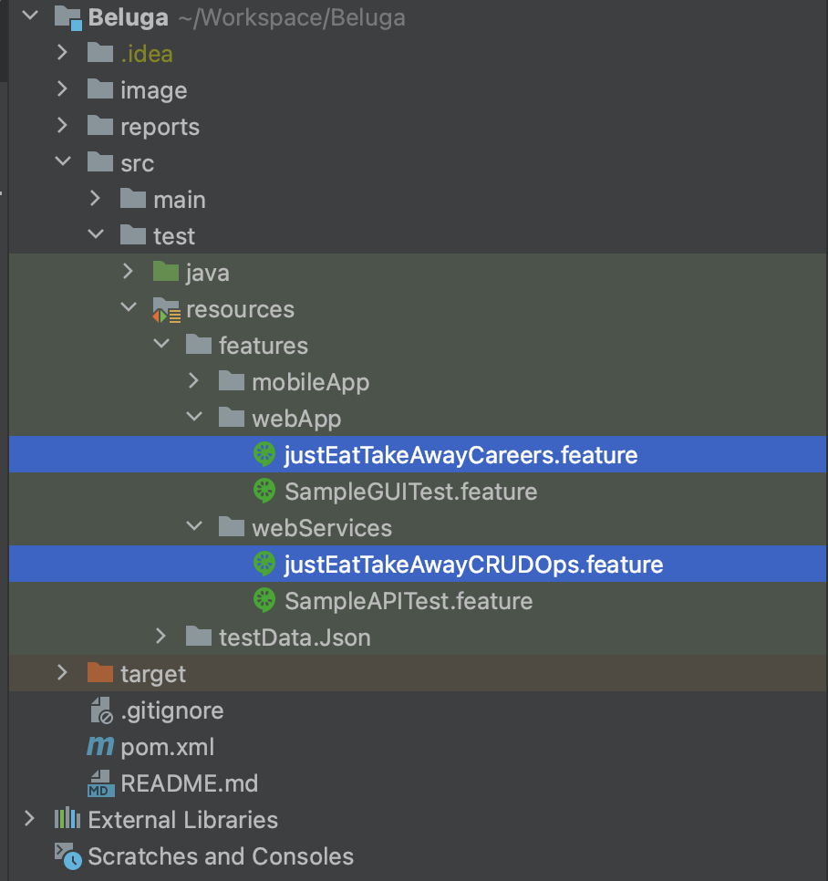
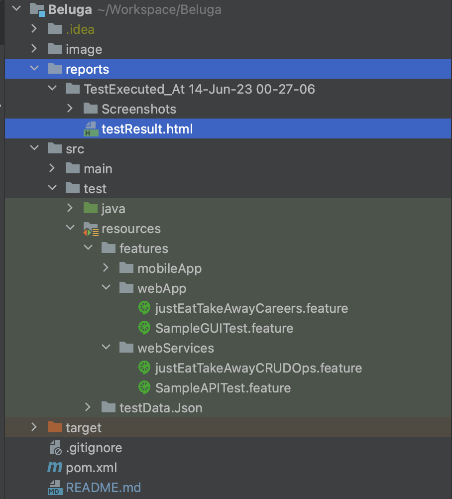

# BELUGA FRAMEWORK

This README provides a brief overview of my **BDD Test framework** "**_Beluga_**" to automate testing of web,mobile applications and web services.

## Introduction

Cucumber is a testing tool that supports Behavior Driven Development (BDD) framework. It allows you to write test cases in a natural language that is easy to understand for non-technical stakeholders. Selenium is a popular open-source testing tool used for automating web browsers. Appium is an open-source tool used for automating mobile applications. RestAssured is a Java library that provides a domain-specific language (DSL) for testing RESTful web services. Java is a popular programming language used for writing test scripts.

## Getting Started
To get started with Beluga Framework, you need to follow below steps:

* Install Java(JDK 18 or above) on your system.
* Install IntelliJ IDEA as IDE.
* Clone the project from Github to your IDE.
* Ensure dependencies from pom.xml file is downloaded into your .m2 folder.

## Execute Test Scripts

To execute the test scripts, after completing above-mentioned steps

In IntelliJ IDE, follow below steps
* Click on Run --> Edit Configuration

* Add new TestNg configuration

* Add your desired Runner Name

* Add the Test runner(FeatureRunner) in the class

* Set the VM options 

Set below parameter for VM Options to execute your Test Script

1. [ ] **-DPLATFORM**="_Browser Name or App_" 
2. [ ] **-Dcucumber.filter.tags**="_Tag for the Test case which needs to be executed_"

### How to set VM Options parameters

`Example VM options` **-DPLATFORM="Chrome" -Dcucumber.filter.tags="@JustEatTakeAwayAssessment"**

_**Parameters accepted in -DPLATFORM**_

* Chrome --> for GUI Testing
* Restful --> for API Testing
* iOS, iOSSimulator --> for mobile Testing

**_Cucumber Tags_**

2 feature files are created for assessment purpose

1. **justEatTakeAwayCareers.feature**
2. **justEatTakeAwayCRUDOps.feature**

you can retrieve any tags from the above feature file to execute the desired test

Once after updating run configuration, RUN the project

### TEST EXECUTION REPORT

Once Test Execution is completed, the extent report folder is generated under **_"reports"_** folder with TimeStamp.

Use **_testResult.html_** file as Test Report

## Software products used in Beluga

- **Cucumber**
- **RestAssured**
- **Selenium**
- **Appium**
- **TestNG**

